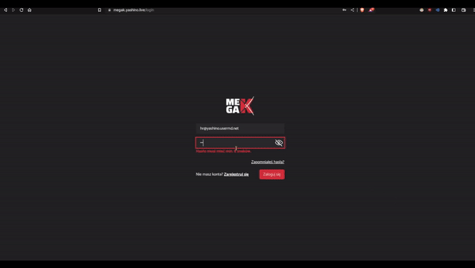
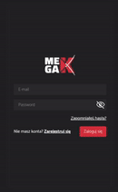

# MegaK-Head-Hunter-Front


**MegaK-Head-Hunter** - It is a full-stack web application that allows headhunters to browse student profiles, add them to conversations, and hire them. The application was created as part of the MegaK course.

The application is divided into three roles: Admin, Student, and HeadHunter. Each of these roles has access to different functionalities.

**Admin** can:

- Add new users,
    - Students through importing the appropriate CSV file,
    - Headhunters through a form.

**Student** can:

- View their data,
- Change their data,
- Mark themselves as hired.

**HeadHunter** can:

- Browse student profiles,
- Add students to conversations,
- Hire students.

Each user can:

- Change their password,
- Reset their password (they receive an email with a password reset link).

### Repositories

- [FRONTEND](https://github.com/xyashino/MegaK-Head-Hunter-Front)
- [BACKEND](https://github.com/xyashino/MegaK-Head-Hunter-BACK)

You are currently browsing the FRONTEND REPOSITORY.

**MegaK-Head-Hunter-Front** - This repository contains the frontend code for the MegaK-Head-Hunter application. It includes:

- Data pagination,
- Data filtering,
- Data search by name,
- Authorization and authentication,
- Routing,
- Communication with the backend,
- Real-time form validation.

### DEMO FROM THE HEADHUNTER'S WEBSITE

<p align="center">
    
</p>

### MOBILE VERSION

<p align="center">
    
</p>

## You can test the demo yourself: [HERE](https://megak.yashino.live/)

Login credentials:

- Admin:
    - **email:** `test@wp.pl`
    - **password:** `12345678`
- HeadHunter:
    - **email:** `hr@yashino.usermd.net`
    - **password:** `12345678`
- Student:
    - **email:** `user@yashino.usermd.net`
    - **password:** `12345678`

Please do not change the login information to allow others to test the application.

If you want to test the application locally, follow these steps:

1. Clone the repository:
```
   git clone https://github.com/xyashino/MegaK-Head-Hunter-Front.git
   ```
2. Zainstaluj zależności:
 ```
   yarn
 ```
3. Run the application:
```
   yarn dev
 ```
### To ensure the proper functioning of the application, you also need the backend, which you can find [HERE](https://github.com/xyashino/MegaK-Head-Hunter-BACK)
#### In the `tsconfig.json` file, there is an alias `@backendTypes`, which points to the path of the backend type files. I recommend cloning the backend in the same folder as the frontend to avoid unnecessary configuration.
